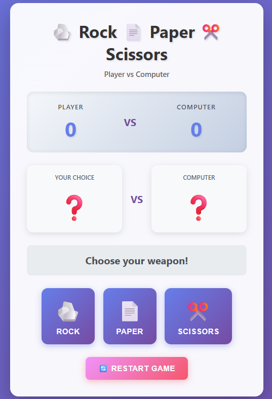
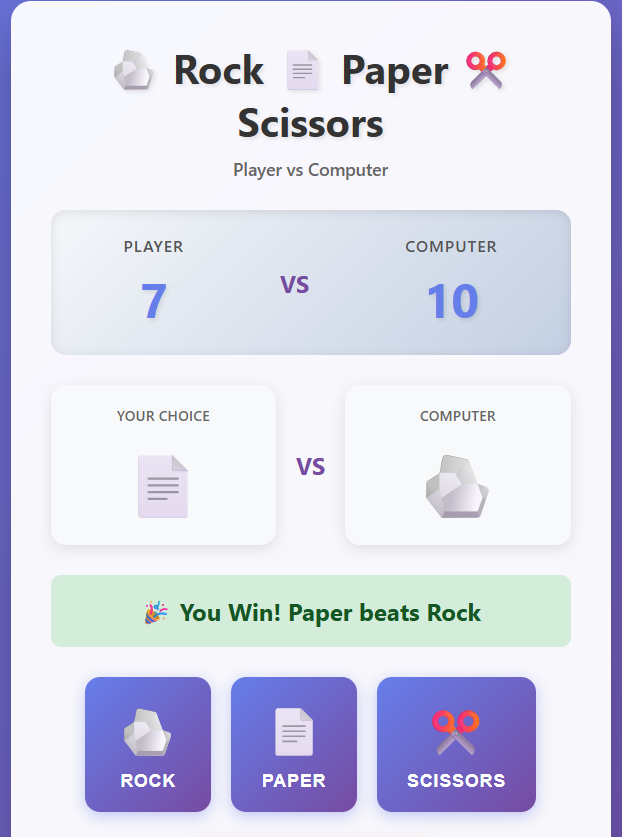

# ✂️ Rock-Paper-Scissors Game

A **fun and interactive Rock-Paper-Scissors game** where the player competes against the computer.  
Built with **HTML, CSS, and JavaScript**, it features **score tracking, round results, and a restart button**.  

---

## 🎯 Features

- Player chooses **Rock, Paper, or Scissors**  
- Computer randomly selects a move  
- Shows **round winner**: Player / Computer / Draw  
- **Score tracking** for Player and Computer  
- **Restart button** to reset the game  
- Responsive, modern, and attractive UI with buttons and icons  
- Optional animations for winning/losing  

---

## 🖼 Screenshots

**Game Start / UI**

**Scoreboard & Round Result**

---

## 📝 How to Play

1. Open `index.html` in your browser  
2. Click one of the **Rock, Paper, or Scissors buttons**  
3. See the **computer's choice** and **round result**  
4. Scoreboard updates automatically  
5. Click **Restart** to reset the game  

---

## 🧪 Testing Steps

- Try clicking **each button** → Ensure correct round outcome  
- Verify **score updates** after each round  
- Test **restart button** → Scoreboard and messages reset  
- Refresh the page → Game should **start fresh**  
- Optional: Add multiple rounds → Check scoreboard accuracy  

---

## 💻 Tech Stack

- **Frontend:** HTML, CSS, JavaScript  
- **Logic:** Random number generation, event handling  

---

## 🌟 Future Enhancements

- Add **sound effects** for winning/losing  
- Animations for **button clicks or winning moves**  
- **Score history tracking** for multiple rounds  
- **Multiplayer mode** to play online with friends  
- Mobile-friendly UI improvements  

---

## 📖 How to Explain

> “This is a Rock-Paper-Scissors game built using HTML, CSS, and JavaScript.  
> The player competes against a computer that randomly selects a move.  
> Scores are tracked dynamically, and the game can be restarted at any time.  
> It demonstrates my skills in **DOM manipulation, event handling, random logic, and UI design**.”
